# parrhesia-frontend

The frontend code for https://parrhesia.chat/

## About

Parrhesia is a very basic end-to-end encrypted chatting service.

## Security

Parrhesia's key exchange uses ML-KEM-768, signatures use ML-DSA-65, and message encryption uses AES-256-GCM. Group key management utilizes efficient re-keying via TreeKEM. Despite these characteristics making Parrhesia post-quantum-safe, parrhesia.chat is still a use-at-your-own-risk service.

ML-KEM-768 and ML-DSA-65 are documented [here](https://csrc.nist.gov/pubs/fips/204/final) and GCM/GMAC is documented [here](https://csrc.nist.gov/pubs/sp/800/38/d/final). TreeKEM key distribution is covered in [this](https://eprint.iacr.org/2025/229.pdf) paper.

## Mermaid Diagram

```mermaid
sequenceDiagram
    participant A as Alice
    participant S as Server
    participant B as Bob
    participant C as Carol

    Note over A,C: Phase 1: Room Creation (REST API)

    A->>S: POST /api/rooms
    S->>S: INSERT INTO rooms (UUID, created_at, last_activity)
    S-->>A: { room_id: UUID }

    Note over A,C: Phase 2: Creator Connects (WebSocket + Creator Election)

    A->>S: WSS /ws/{room_id}
    S->>S: room_exists(room_id) → true
    S->>S: set_creator(Alice) — atomic UPDATE WHERE creator_id IS NULL
    S-->>A: welcome { peer_id, is_creator: true, creator_id }
    A->>A: Load/generate ML-DSA-65 keypair (secret: 4032B, public: 1952B)
    A->>A: Generate ephemeral ML-KEM-768 keypair (public: 1184B)
    A->>A: sig = ML-DSA-65.sign(mlKemPub, dsaSecretKey)
    A->>S: key_announce { dsa_pub, kem_pub, sig }
    S->>S: Validate key sizes: decode(dsa_pub)==1952B, decode(kem_pub)==1184B
    S->>S: try_add_participant — atomic INSERT WHERE room COUNT < 16
    S->>S: get_other_public_keys → empty (no peers yet)
    S->>S: Broadcast PeerJoined via tokio channel (per-room, capacity: 100)
    A->>A: TreeKemState.createForCreator(kemPub, kemSk) — single-leaf tree
    A->>A: rootSecret → HKDF-SHA256("parrhesia-tree-root") → AES-256 group key
    A->>A: HKDF(groupKey, "parrhesia-chain-" + myPeerId) → own chain key

    Note over A,C: Phase 3: Bob Joins (Peer Sync + Signature Verification)

    B->>S: WSS /ws/{room_id}
    S->>S: set_creator(Bob) → false (creator already elected)
    S-->>B: welcome { peer_id, is_creator: false, creator_id: Alice }
    B->>B: Load/generate ML-DSA-65 + ephemeral ML-KEM-768
    B->>B: sig = ML-DSA-65.sign(mlKemPub, dsaSecretKey)
    B->>S: key_announce { dsa_pub, kem_pub, sig }
    S->>S: Validate key sizes + try_add_participant (COUNT < 16)
    S-->>B: peer_key { Alice's dsa_pub, kem_pub, sig }
    Note over S: peer_key = existing peers from DB (sent to joiner only)
    S->>S: Broadcast PeerJoined(Bob) to room channel
    S-->>A: peer_joined { Bob's dsa_pub, kem_pub, sig }
    Note over S: peer_joined = new arrival broadcast (sent to all existing peers)

    A->>A: TOFU: checkPeerKey(Bob) — store if new, reject if key changed
    A->>A: ML-DSA-65.verify(Bob's sig on kemPub using Bob's dsaPub)
    A->>A: addPeer(Bob) → derive color, store keys
    A->>A: TreeKEM addLeaf(Bob's kemPub) → blank affected path nodes

    B->>B: TOFU: checkPeerKey(Alice) — store if new
    B->>B: ML-DSA-65.verify(Alice's sig on kemPub using Alice's dsaPub)
    B->>B: addPeer(Alice) → derive color, store keys

    Note over A,C: Phase 4: TreeKEM Key Distribution (2-Peer)

    A->>A: shouldInitiateRekey() → sort all conn_ids, lowest initiates
    Note over A,B: Rekey Initiator (lowest sorted conn_id) drives TreeKEM
    A->>A: generateCommit: new leaf secret → HKDF-SHA256 path node secrets
    A->>A: Per copath node: ML-KEM-768.encapsulate(secret, copathNodePub)
    A->>S: tree_commit { committerLeafPos, leafPubKey, path[], epoch }
    S-->>B: tree_commit (broadcast to all peers except sender)
    A->>A: generateWelcome(Bob): tree public keys + ML-KEM-encrypted path secret
    A->>S: tree_welcome { target_peer_id: Bob, treePublicKeys[], pathSecrets[] }
    S-->>B: tree_welcome (targeted delivery: server filters by target_conn_id)

    B->>B: fromWelcome: ML-KEM-768.decapsulate(pathSecret, myKemSk)
    B->>B: HKDF chain: node secret → parent → ... → root secret
    B->>B: rootSecret → HKDF → AES-256 group key
    B->>B: Init chains: HKDF(groupKey, peerId) for self + each peer

    Note over A,C: Phase 5: Third Peer Joins (N-Peer Scaling)

    C->>S: WSS /ws/{room_id}
    S->>S: set_creator(Carol) → false
    S-->>C: welcome { peer_id, is_creator: false, creator_id: Alice }
    C->>S: key_announce { dsa_pub, kem_pub, sig }
    S->>S: Validate + try_add_participant
    S-->>C: peer_key { Alice's keys }
    S-->>C: peer_key { Bob's keys }
    Note over S: Joiner receives one peer_key per existing participant from DB
    S-->>A: peer_joined { Carol's keys }
    S-->>B: peer_joined { Carol's keys }
    Note over S: All existing peers receive peer_joined broadcast

    par All existing peers verify and add Carol
        A->>A: TOFU + verify sig + addPeer + TreeKEM addLeaf(Carol)
        B->>B: TOFU + verify sig + addPeer + TreeKEM addLeaf(Carol)
    end
    par Carol verifies all existing peers
        C->>C: TOFU + verify Alice's sig + addPeer(Alice)
        C->>C: TOFU + verify Bob's sig + addPeer(Bob)
    end

    Note over A,C: Lowest sorted conn_id initiates rekey for new peer
    A->>S: tree_commit (broadcast to all)
    S-->>B: tree_commit
    S-->>C: tree_commit
    A->>S: tree_welcome (targeted to Carol only)
    S-->>C: tree_welcome

    B->>B: processCommit → find decryptable copath node → derive new root
    C->>C: fromWelcome → ML-KEM decapsulate → derive root + init all chains

    Note over A,C: Phase 6: Encrypted Messaging (Per-Message Chain Ratchet)

    A->>A: ratchet(myChainKey) → HKDF → one-time messageKey + nextChainKey
    A->>A: AES-256-GCM.encrypt(plaintext, messageKey, 12B random IV)
    A->>S: message { payload: base64(IV || ciphertext), epoch, counter }
    S->>S: UPDATE rooms SET last_activity = now WHERE id = room_id
    S-->>B: message { peer_id: Alice, payload, epoch, counter }
    S-->>C: message { peer_id: Alice, payload, epoch, counter }
    Note over S: Server relays opaque payload — never decrypts
    B->>B: Ratchet peerChain[Alice] to counter → derive messageKey → decrypt
    C->>C: Ratchet peerChain[Alice] to counter → derive messageKey → decrypt
    Note over B,C: Out-of-order handling: ratchet forward, cache skipped keys (max 100)

    Note over A,C: Phase 7: Automatic Rekey (Every 50 Messages)

    A->>A: messagesSinceRekey >= 50 && shouldInitiateRekey()
    A->>A: Save current epoch chains (kept 30s for in-flight messages)
    A->>A: epoch++, generateCommit → fresh leaf secret + new path keys
    A->>S: tree_commit { epoch: N+1 }
    S-->>B: tree_commit
    S-->>C: tree_commit
    B->>B: savePreviousEpochChains, processCommit → new root secret
    C->>C: savePreviousEpochChains, processCommit → new root secret
    Note over A,C: New epoch: new group key, all chains reset to counter 0
    Note over A,C: Messages from epoch N-1 still decryptable for 30s grace period

    Note over A,C: Phase 8: Peer Departure + Forward Secrecy

    B->>S: WebSocket close
    S->>S: DELETE FROM participants WHERE id = Bob
    S->>S: reset_creator_if_empty → false (Alice + Carol remain)
    S->>S: Broadcast PeerLeft(Bob) via room channel
    S-->>A: peer_left { peer_id: Bob }
    S-->>C: peer_left { peer_id: Bob }
    A->>A: removePeer(Bob) → TreeKEM removeLeaf + blank path + delete chain
    C->>C: removePeer(Bob) → TreeKEM removeLeaf + blank path + delete chain
    A->>A: shouldInitiateRekey() && hasPeers() → true
    A->>S: tree_commit (post-removal rekey)
    S-->>C: tree_commit
    Note over A,C: New epoch ensures departed peer cannot decrypt future messages

    Note over A,C: Phase 9: Room Lifecycle + Server Infrastructure

    Note over S: Keepalive: server PINGs every 30s, expects PONG within 10s
    Note over S: Cleanup task runs every 5 min (configurable)
    S->>S: DELETE rooms WHERE last_activity < now - 24h (configurable)
    S->>S: Broadcast RoomExpired to active connections
    S-->>A: room_expired
    S-->>C: room_expired
    Note over A,C: Connections closed, room purged from DB + broadcast map
    Note over S: When last peer leaves: creator_id reset to NULL for next session
```

## License
[MIT](https://opensource.org/license/mit)