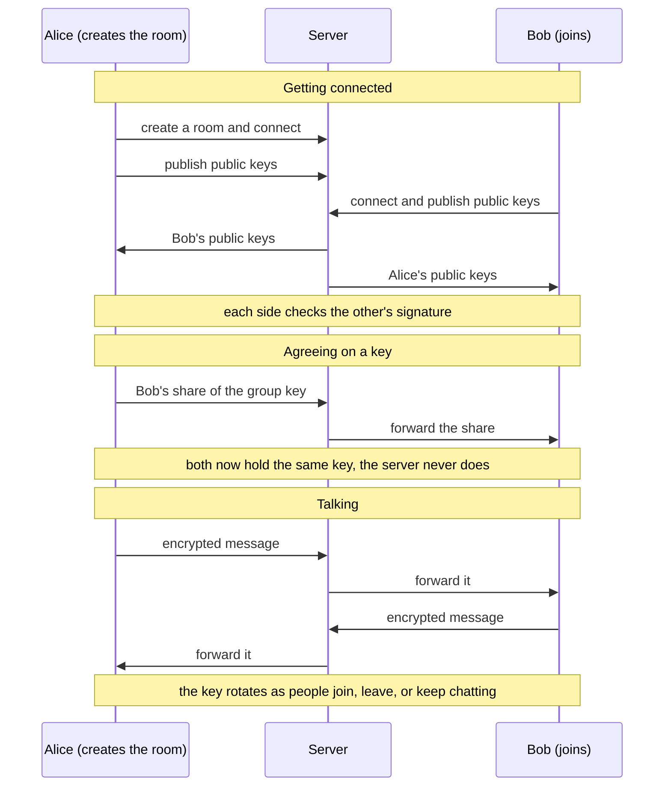

# parrhesia-frontend

[](https://github.com/longestneckedgiraffe/parrhesia-frontend/actions/workflows/ci.yml)

End-to-end encrypted chat with no accounts and post-quantum cryptography. Runs at [parrhesia.chat](https://parrhesia.chat/).

This is the browser client. The relay server lives in [parrhesia-backend](https://github.com/longestneckedgiraffe/parrhesia-backend).

## What's Parrhesia?

Create a room, send someone the link, and talk. Your browser does the encryption, so the server only sees ciphertext. Rooms expire on their own and there is nothing to sign up for. To check who is on the other end, compare the safety number shown for a peer or scan their QR code.

parrhesia.chat is free and always will be. I run it and pay for it myself, with no ads and no paid tier.

More features are planned for parrhesia. To stay up to date, check out my blog.

## Running it

```bash
npm install
npm run dev
```

You need the [backend](https://github.com/longestneckedgiraffe/parrhesia-backend) running too, since this side is only the client. `npm run build` writes a static bundle to `dist/`. It needs Node 20.19 or newer and a browser with WebCrypto.

## Security

Key exchange uses [ML-KEM-768](https://csrc.nist.gov/pubs/fips/203/final), signatures use [ML-DSA-65](https://csrc.nist.gov/pubs/fips/204/final), and messages use [AES-256-GCM](https://csrc.nist.gov/pubs/sp/800/38/d/final). Parrhesia manages the shared group key with a TreeKEM-style ratchet tree, so rekeying stays cheap when people join or leave, and every sender ratchets a fresh key per message on top of it. Each sender drops old keys as its chain advances, so cracking the current state will not open earlier messages. The server never holds a key.

> [!WARNING]
> parrhesia.chat is a use-at-your-own-risk service. Please do not rely on it to transmit sensitive or incriminating information.

## Protocol


```mermaid
sequenceDiagram
    participant A as Alice (creates the room)
    participant S as Server
    participant B as Bob (joins)

    Note over A,B: Getting connected

    A->>S: create a room and connect
    A->>S: publish public keys
    B->>S: connect and publish public keys
    S->>A: Bob's public keys
    S->>B: Alice's public keys
    Note over A,B: each side checks the other's signature

    Note over A,B: Agreeing on a key

    A->>S: Bob's share of the group key
    S->>B: forward the share
    Note over A,B: both now hold the same key, the server never does

    Note over A,B: Talking

    A->>S: encrypted message
    S->>B: forward it
    B->>S: encrypted message
    S->>A: forward it
    Note over A,B: the key rotates as people join, leave, or keep chatting
```

## License

[MIT](https://opensource.org/license/mit).
